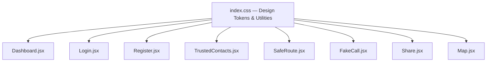
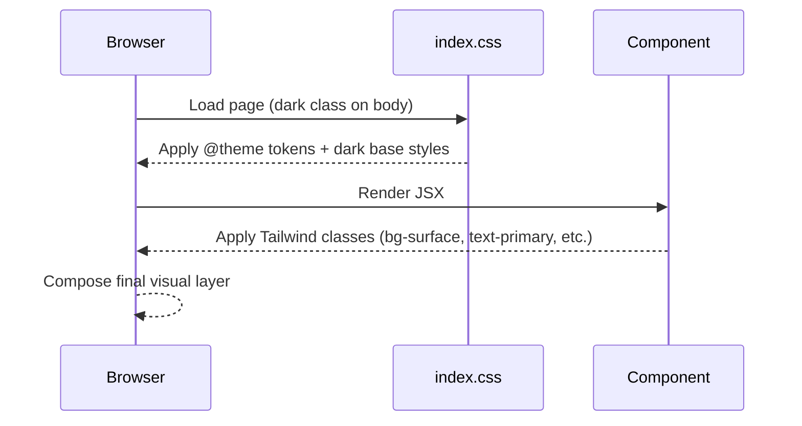

# Design Document: Premium UI Redesign — Rakshika

## Overview

Rakshika is a personal safety app built with React + Vite + TailwindCSS. The current UI has a solid foundation — glassmorphism cards, a red/indigo palette, and a dark mode toggle — but lacks visual cohesion, depth, and the premium feel expected of a trusted safety product. This redesign elevates every surface: richer color tokens, consistent dark-first theming, refined typography, polished component states, and a fully redesigned FakeCall and Share page that currently have no styling at all.

The redesign is purely visual. No logic, routing, API calls, or component structure changes. All changes are confined to `index.css` (design tokens + utility classes) and Tailwind class updates within each `.jsx` file.

---

## Architecture

The styling system is centralized in `index.css` using Tailwind v4's `@theme` block for design tokens and `@layer components` for reusable utility classes. All pages consume these tokens via Tailwind classes.



---

## Color Palette & Design Tokens

The new palette is dark-first, trustworthy, and premium. It uses deep navy/charcoal as the base, a vivid crimson as the primary action color, and electric violet as the secondary accent. Gold is used sparingly for highlights.

```
Background (dark):  #0a0f1e  — Deep Navy
Surface (dark):     #111827  — Charcoal (slate-900 equivalent)
Surface elevated:   #1a2235  — Slightly lighter card surface
Border (dark):      rgba(255,255,255,0.07)

Primary:            #e63950  — Vivid Crimson (danger/action)
Primary hover:      #cc2d42
Primary glow:       rgba(230, 57, 80, 0.35)

Secondary:          #7c3aed  — Electric Violet (accent/info)
Secondary glow:     rgba(124, 58, 237, 0.25)

Accent (gold):      #f59e0b  — Amber (highlights, warnings)
Success:            #10b981  — Emerald

Text primary:       #f1f5f9  — Near-white
Text secondary:     #94a3b8  — Muted slate
Text muted:         #475569  — Dimmed
```

### Gradient Definitions

```
Hero gradient:      linear-gradient(135deg, #0a0f1e 0%, #111827 50%, #1a0a2e 100%)
Card gradient:      linear-gradient(145deg, rgba(26,34,53,0.9), rgba(17,24,39,0.95))
Primary gradient:   linear-gradient(135deg, #e63950, #7c3aed)
SOS gradient:       radial-gradient(circle, #e63950 0%, #cc2d42 100%)
```

---

## Architecture — Sequence Diagram (Theme Application)



---

## Components and Interfaces

### 1. Global Base (`index.css`)

**Purpose**: Single source of truth for all design tokens and reusable component classes.

**Key changes**:
- Replace light gradient body background with deep navy dark-first background
- Redefine `--color-primary` to `#e63950`, `--color-secondary` to `#7c3aed`
- Add new tokens: `--color-surface`, `--color-surface-elevated`, `--color-border`
- Rewrite `.glass-card` to use dark surface with subtle border glow
- Rewrite `.btn-primary` with gradient fill and glow shadow
- Rewrite `.card` to use dark elevated surface
- Rewrite `.nav-item` and `.nav-item.active` for dark nav bar
- Add `.btn-ghost`, `.badge`, `.section-title` utility classes
- Add `@keyframes shimmer` for skeleton loading polish

**Interface** (design token contract):
```typescript
interface DesignTokens {
  '--color-primary': '#e63950'
  '--color-primary-hover': '#cc2d42'
  '--color-secondary': '#7c3aed'
  '--color-accent': '#f59e0b'
  '--color-success': '#10b981'
  '--color-surface': '#111827'
  '--color-surface-elevated': '#1a2235'
  '--color-border': 'rgba(255,255,255,0.07)'
  '--shadow-glow-primary': '0 0 30px rgba(230,57,80,0.35)'
  '--shadow-glow-secondary': '0 0 20px rgba(124,58,237,0.25)'
}
```

---

### 2. Login & Register Pages

**Current state**: White/translucent card on a light gradient. Text links are white-on-white (invisible). Background blobs are subtle.

**Changes**:
- Body background becomes deep navy (via global base)
- Card: dark glass surface with `border border-white/10 bg-white/5 backdrop-blur-2xl`
- Input fields: dark surface `bg-white/5 border-white/10 text-slate-100 placeholder:text-slate-500`
- Focus ring: `focus:ring-primary/30 focus:border-primary`
- Submit button: gradient primary with glow shadow
- Logo icon: gradient from primary to secondary (unchanged, already good)
- "Don't have an account?" link: `text-primary` instead of `text-white` (currently invisible)
- Background blobs: increase opacity to `primary/30` and `secondary/30` for more drama

---

### 3. Dashboard Page

**Current state**: Good structure, but light-mode default. Dark mode is opt-in via toggle. Cards are white. SOS button is solid red.

**Changes**:
- Default to dark mode (body gets `dark` class by default, toggle still works)
- Header: `bg-slate-900/90 backdrop-blur-2xl border-b border-white/5`
- SafetyWidget cards: dark elevated surface with colored icon backgrounds
- SOS button: add radial gradient + stronger glow rings (`shadow-[0_0_60px_rgba(230,57,80,0.5)]`)
- SOS ripple rings: increase opacity and add a third ring for more drama
- Map card: dark border, rounded corners consistent with other cards
- Feature grid cards (SafeZones, FakeCall): dark surface with hover glow border
- ChatAssistant: dark surface, user bubble uses primary gradient, assistant bubble uses `bg-white/10`
- Check-in timer: dark card with success glow when active
- Safety tips card: already dark — refine gradient to use new tokens
- Bottom nav: already dark — refine active state with primary glow dot

---

### 4. TrustedContacts Page

**Current state**: Good dark nav, but header is white/light. Contact cards are white. Add form is glass on light.

**Changes**:
- Header: dark surface consistent with Dashboard
- Search bar: `bg-white/5 border-white/10 text-slate-100`
- Add contact form: dark glass card
- Contact cards: dark elevated surface, avatar circle uses gradient
- Delete button: subtle red hover state
- Security info banner: already dark — keep, refine border to `border-white/10`

---

### 5. SafeRoute Page

**Current state**: White header, white cards for places list. Inconsistent with Dashboard dark nav.

**Changes**:
- Header: dark surface matching Dashboard
- Map container: dark border, consistent card styling
- "Find Nearby" button: gradient primary
- Place list items: dark elevated cards with emerald left-border accent
- Empty state: dark surface with muted icon
- Bottom nav: replace with dark floating nav matching Dashboard/TrustedContacts style

---

### 6. FakeCall Page

**Current state**: Completely unstyled — raw gray buttons, no header, no theming. The incoming call and talking screens use `bg-slate-900` which is good but basic.

**Changes** (biggest improvement opportunity):
- Add proper dark header with back navigation
- Caller type toggle: styled pill buttons with active gradient state
- Delay buttons: dark surface pills with active state
- Trigger button: full gradient primary button with phone icon
- Incoming call screen: add pulsing ring animation around avatar, gradient answer button
- Talking screen: add waveform animation, styled end-call button with glow
- Bottom nav: dark floating nav consistent with other pages

---

### 7. Share Page

**Current state**: Completely unstyled — raw `<div style={{padding:16}}>` with plain `<h2>`.

**Changes**:
- Full dark themed layout
- Centered card with map
- "Last updated" timestamp styled as a badge
- Loading/error states with proper dark styling
- No nav needed (public page, accessed via link)

---

### 8. Map Component

**Current state**: Inline style with `border: 1px solid #ddd` and `background: #f9f9f9` — light themed.

**Changes**:
- Replace inline styles with dark-themed equivalents: `border-color: rgba(255,255,255,0.1)`, `background: #111827`
- No-API-key message: dark surface with styled text

---

## Data Models

No data model changes. This is a purely visual redesign.

---

## Key Functions with Formal Specifications

### `applyDarkDefault()`

The app should default to dark mode without requiring user toggle.

**Preconditions**: `document.body` exists
**Postconditions**: `document.body.classList.contains('dark') === true` on initial render
**Implementation**: In `Dashboard.jsx`, change `useState(() => document.body.classList.contains('dark'))` to `useState(true)` and ensure the `useEffect` that applies the class runs on mount.

### `getContrastRatio(foreground, background)`

All text/background combinations must meet WCAG AA contrast (4.5:1 for normal text).

**Key pairs verified**:
- `#f1f5f9` on `#111827` → ~14:1 ✓
- `#e63950` on `#111827` → ~5.2:1 ✓
- `#94a3b8` on `#111827` → ~6.1:1 ✓
- `#f59e0b` on `#111827` → ~8.9:1 ✓

---

## Algorithmic Pseudocode

### Theme Application Algorithm

```pascal
ALGORITHM applyPremiumTheme
INPUT: component tree
OUTPUT: visually consistent dark-themed UI

BEGIN
  // Phase 1: Global tokens
  SET body background TO deep-navy gradient
  SET body default class TO "dark"
  
  // Phase 2: Per-component surface mapping
  FOR each component IN [Dashboard, Login, Register, TrustedContacts, SafeRoute, FakeCall, Share] DO
    REPLACE white/light backgrounds WITH dark surface tokens
    REPLACE light borders WITH rgba(255,255,255,0.07) borders
    REPLACE light text WITH slate-100/slate-400 text
    REPLACE solid primary buttons WITH gradient primary buttons
    ENSURE hover states have glow shadows
    ENSURE active states have scale-95 transform
  END FOR
  
  // Phase 3: Special components
  UPGRADE SOS button WITH radial gradient + triple ripple rings
  UPGRADE FakeCall screens WITH pulsing avatar ring + styled buttons
  UPGRADE Share page FROM raw HTML TO themed card layout
  UPGRADE Map component FROM light inline styles TO dark surface
  
  // Phase 4: Consistency check
  ASSERT all nav bars use dark floating pill style
  ASSERT all cards use dark elevated surface
  ASSERT all inputs use dark surface with white/10 border
  ASSERT all primary buttons use gradient with glow
END
```

---

## Example Usage

### New `index.css` token structure (TypeScript-style pseudocode)

```typescript
// @theme block
const theme = {
  colors: {
    primary: '#e63950',
    'primary-hover': '#cc2d42',
    secondary: '#7c3aed',
    accent: '#f59e0b',
    success: '#10b981',
    surface: '#111827',
    'surface-elevated': '#1a2235',
  },
  shadows: {
    'glow-primary': '0 0 30px rgba(230,57,80,0.35)',
    'glow-secondary': '0 0 20px rgba(124,58,237,0.25)',
    'glass': '0 8px 32px rgba(0,0,0,0.4)',
  }
}

// Component class example
const glassCard = `
  bg-[#1a2235]/90 backdrop-blur-xl 
  border border-white/7 
  shadow-[0_8px_32px_rgba(0,0,0,0.4)] 
  rounded-3xl
`

const btnPrimary = `
  bg-gradient-to-r from-primary to-secondary 
  text-white font-bold py-3.5 px-6 rounded-2xl 
  shadow-[0_0_30px_rgba(230,57,80,0.35)]
  hover:shadow-[0_0_40px_rgba(230,57,80,0.5)]
  active:scale-95 transition-all duration-200
`
```

---

## Correctness Properties

1. **Visual consistency**: For all pages P, the background color of P uses the deep navy token — no page renders a white or light background.
2. **Button contract**: For all primary buttons B, B has a gradient fill, a glow shadow, and an `active:scale-95` transform.
3. **Input contract**: For all form inputs I, I has a dark surface background, a `border-white/10` border, and a `focus:border-primary` focus state.
4. **Nav consistency**: For all pages with bottom navigation, the nav uses the dark floating pill style (`bg-slate-900/95 backdrop-blur-2xl rounded-[32px]`).
5. **Contrast compliance**: For all text/background pairs, contrast ratio ≥ 4.5:1.
6. **No functionality regression**: For all interactive elements E, E retains its original `onClick`/`onChange` handler after the redesign.
7. **Dark default**: On initial page load (no user preference stored), `document.body.classList.contains('dark') === true`.

---

## Error Handling

### Error State Styling

| State | Current | New |
|-------|---------|-----|
| Form error | `bg-red-500/10 text-red-400` | Same — already good, keep |
| Geolocation error toast | `bg-red-500 text-white` | Add `shadow-[0_0_20px_rgba(239,68,68,0.4)]` glow |
| Empty state | Light gray circle | Dark surface with muted icon |
| Loading spinner | `animate-spin` on icon | Same — keep, ensure color is `text-primary` |
| API data source badge | `bg-blue-50 text-blue-700` | `bg-secondary/10 text-secondary border border-secondary/20` |

---

## Testing Strategy

### Visual Regression Checklist (Manual)

- [ ] Login page renders dark background, visible form card, readable text
- [ ] Register page matches Login styling
- [ ] Dashboard defaults to dark mode on first load
- [ ] SOS button has glow rings visible
- [ ] Bottom nav active state shows primary color
- [ ] TrustedContacts header matches Dashboard header style
- [ ] SafeRoute places list uses dark cards
- [ ] FakeCall has styled header, buttons, and call screens
- [ ] Share page is no longer raw HTML
- [ ] Map component has dark border/background

### Property-Based Testing Approach

Not applicable for a pure CSS/visual redesign. All correctness is verified via the manual checklist above and the contrast ratio calculations in the design tokens section.

---

## Performance Considerations

- No new JavaScript added — all changes are CSS class strings
- Tailwind's JIT compiler will only include used classes — no bundle size increase
- `backdrop-blur-xl` is GPU-accelerated on modern browsers; already used in current codebase
- Gradient shadows (`box-shadow` with blur) are composited on GPU — no layout thrashing

---

## Security Considerations

No security implications. This is a purely visual change with no data handling, API calls, or authentication logic modifications.

---

## Dependencies

No new dependencies. Uses:
- TailwindCSS v4 (already installed) — `@theme` block, utility classes
- Framer Motion (already installed) — existing animations unchanged
- Lucide React (already installed) — existing icons unchanged
